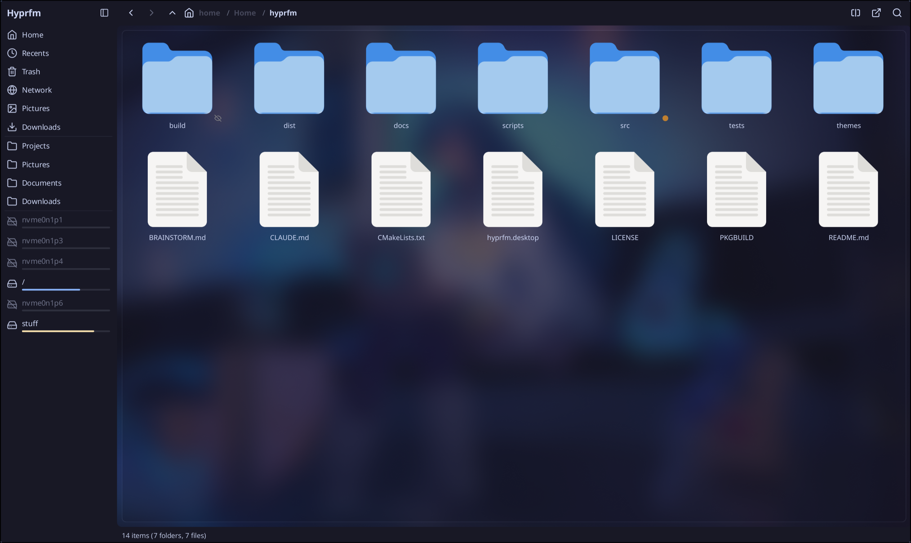
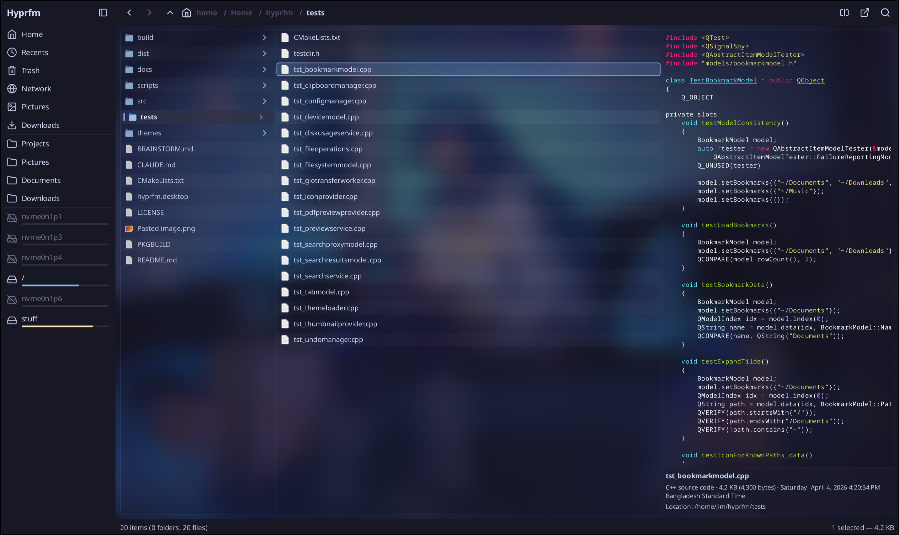
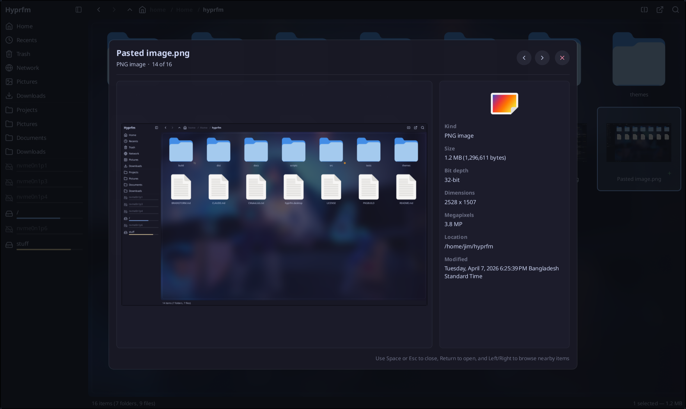

<div align="center">


# HyprFM

**A fast, keyboard-friendly file manager for Hyprland and Wayland desktops.**

[](LICENSE)
[](https://github.com/soyeb-jim285/hyprfm/releases)
[](https://aur.archlinux.org/packages/hyprfm-git)
[](https://github.com/soyeb-jim285/hyprfm/actions)

</div>

---

HyprFM is a Qt6/QML file manager designed to feel native on Hyprland: lightweight, themeable, and built around fast keyboard navigation. It pairs a polished UI with the practical features power users expect, including Miller column view, kinetic scrolling, drag & drop, async operations, rich previews, and a TOML-based theme system.

<div align="center">


*Miller columns with a live preview pane, then bulk rename with its preview list*

</div>

<div align="center">


*Grid view with built-in icon set, themed sidebar, and live preview blur*

</div>

---

## 🧭 Contents

<!-- Heading emoji must not carry a U+FE0F variation selector. GitHub keeps it
     in the generated slug but percent-encodes it inside a link, so the two
     never match and the entry silently stops jumping. Verify with
     `gh api repos/OWNER/REPO/readme -H 'Accept: application/vnd.github.html'`
     after renaming a heading. -->

- [✨ Features](#-features)
  - [Views](#views)
  - [Navigation & input](#navigation--input)
  - [File operations](#file-operations)
  - [Look & feel](#look--feel)
  - [Integrations](#integrations)
- [📦 Installation](#-installation)
  - [Arch Linux (AUR)](#arch-linux-aur)
  - [Flatpak (self-hosted)](#flatpak-self-hosted)
  - [AppImage (any distro)](#appimage-any-distro)
  - [Nix (flake)](#nix-flake)
  - [Build from source](#build-from-source)
- [⌨ Keyboard shortcuts](#-keyboard-shortcuts)
  - [Navigation](#navigation)
  - [Views](#views-1)
  - [Tabs & windows](#tabs--windows)
  - [File operations](#file-operations-1)
- [⚙ Configuration](#-configuration)
- [🎨 Theming](#-theming)
  - [Light and dark](#light-and-dark)
- [🧱 Architecture](#-architecture)
- [🤝 Contributing](#-contributing)
- [📜 License](#-license)

---

## ✨ Features

### Views

- **Grid view** with adjustable column count (`Ctrl+Scroll` to zoom)
- **Detailed view** with sortable columns, image/video thumbnails, and folder item counts
- **Miller columns** (`Ctrl+2`): parent · current · live preview, the macOS Finder favorite
- **Image and video thumbnails** in detailed and Miller views
- **Quick preview** (`Space`): full-screen overlay for images, video (poster frame), PDFs, text and rendered Markdown, with metadata sidebar
- **Split pane** (`F3`): work in two directories side by side

<div align="center">


*Miller column view with rich text preview and syntax highlighting*

</div>

### Navigation & input

- **Full keyboard navigation**: arrows, vim-friendly shortcuts, type-ahead search
- **Tabs** with independent history per pane
- **Path bar** with breadcrumbs and inline editing (`Ctrl+L`)
- **Bookmarks sidebar** with drag-to-reorder, inline rename, and udisks2 device mounting
- **Kinetic wheel scrolling** with momentum and rubber-band overscroll
- **Rubber-band selection** in all views

### File operations

- **Async copy / move** via GIO with live progress, speed, ETA, and pause
- **Drag & drop** between panes, tabs, and external apps (Wayland-native)
- **Trash** with restore (XDG-compliant)
- **Bulk rename**: find/replace (plain or regex), prefix/suffix, numbered sequences
- **Compress / extract** archives
- **Open With** dialog populated from `.desktop` entries
- **Undo/redo** for file operations

### Look & feel

- **TOML themes** with live reload — Catppuccin Mocha/Latte and Rose Pine/Moon/Dawn bundled
- **Built-in SVG icon set** (90+ Lucide-style icons rendered via Qt Shapes)
- **Configurable corner radius**, fonts, animation duration
- **Wayland compositor blur** on Hyprland plus native KWin blur on KDE Plasma

### Integrations

- **udisks2** mount/unmount of removable drives
- **gvfs / gio** for SFTP, SMB and MTP (the trash is read directly and does not need it)
- **Git status overlays** in file lists (modified, staged, untracked, …)
- **wl-clipboard** for system clipboard
- **bat** for syntax-highlighted text previews
- **md4c** for rendered Markdown previews (via `md2html`)
- **ffmpeg** for video poster thumbnails
- **Poppler** for PDF page previews

<div align="center">


*Quick preview overlay (Space): image preview with full metadata sidebar*

</div>

---

## 📦 Installation

### Arch Linux (AUR)

```bash
yay -S hyprfm-git
```

The PKGBUILD pulls latest `main`, builds with Ninja + parallel jobs + tests disabled, and installs to `/usr/bin/hyprfm`.

### Flatpak (self-hosted)

HyprFM publishes a signed Flatpak repository at `hyprfm.soyebjim.me`. Because HyprFM depends on the KDE Platform runtime from Flathub, the Flathub remote must exist at the **same scope** you install into. For `--user` installs, that means a `--user` Flathub remote. Add both remotes once and install:

```bash
# Flathub at user scope (provides org.kde.Platform)
flatpak remote-add --user --if-not-exists \
    flathub https://dl.flathub.org/repo/flathub.flatpakrepo

# HyprFM repo
flatpak remote-add --user --if-not-exists \
    hyprfm https://flatpak.hyprfm.soyebjim.me/hyprfm.flatpakrepo
flatpak install --user hyprfm io.github.soyeb_jim285.HyprFM
```

If you'd rather install system-wide, drop every `--user` flag and prefix with `sudo`; system Flathub is already configured on most distros.

Updates arrive via the usual `flatpak update`. The repo is signed with a GPG key committed at [`public-key.asc`](https://github.com/soyeb-jim285/hyprfm-flatpak-repo/blob/main/public-key.asc); Flatpak verifies every download against it automatically.

Each tagged release also attaches an `HyprFM-vX.Y.Z-x86_64.flatpak` bundle to the GitHub release for users who want a single-file install without adding a remote.

### AppImage (any distro)

```bash
curl -LO "$(curl -fsSL https://api.github.com/repos/soyeb-jim285/hyprfm/releases/latest \
    | grep -o 'https://[^"]*\.AppImage')"
chmod +x HyprFM-*.AppImage
./HyprFM-*.AppImage
```

The asset name carries the version, so grab the current one from the
[releases page](https://github.com/soyeb-jim285/hyprfm/releases/latest) if you would rather not pipe through `curl`.

The AppImage is fully self-contained. You do not need a system Qt installation.

### Nix (flake)

```bash
nix run github:soyeb-jim285/hyprfm
```

Or pull it into a system/home-manager flake:

```nix
{
  inputs.hyprfm.url = "github:soyeb-jim285/hyprfm";
}
```

then reference `hyprfm.packages.<system>.default` in `environment.systemPackages` / `home.packages`. The package version is parsed straight from `CMakeLists.txt`, so it always tracks the tree it's built from.

The package bundles the tools HyprFM shells out to, including archive handling,
previews, search and the gvfs client module, so nothing else has to be
installed alongside it.

It cannot bundle the gvfs daemon. `gvfsd` and its backends are D-Bus-activated
per-session services, so they come from the session rather than from an
application's closure. On NixOS:

```nix
services.gvfs.enable = true;
```

Without it the Trash still works, because HyprFM reads the trash directories
directly, but the Network sidebar (`sftp://`, `smb://`, `mtp://`) has nothing to
connect to. On a non-NixOS host the distro's own gvfs covers this.

### Build from source

```bash
git clone --recursive https://github.com/soyeb-jim285/hyprfm.git
cd hyprfm
cmake -B build -G Ninja \
    -DCMAKE_BUILD_TYPE=Release \
    -DBUILD_TESTS=OFF
cmake --build build --parallel
./build/src/hyprfm
```

> **Note:** the `--recursive` flag is important: HyprFM uses Git submodules for the [Quill](https://github.com/soyeb-jim285/quill) component library and the [quill-icons](https://github.com/soyeb-jim285/quill-icons) icon set.

#### AppImage from source

To build a self-contained AppImage from the current checkout, useful for testing a fix that is on `main` but not yet released:

```bash
./scripts/build-appimage-local.sh
```

The result lands in the repo root as `HyprFM-<version>-x86_64.AppImage`. The script downloads `linuxdeploy` into `appimage-tools/` on first run, bundles Qt, and runs an offscreen smoke test before finishing. It needs `curl` or `wget` on top of the build dependencies below.

#### Dependencies

| | Packages |
|---|---|
| **Required (build)** | `cmake`, `ninja`, `qt6-base`, `qt6-declarative`, `qt6-svg` |
| **Required (runtime)** | `qt6-base`, `qt6-declarative`, `qt6-svg`, `qt6-wayland`, `glib2`, `xdg-utils` |
| **Archives** | `tar`, `gzip`, `bzip2`, `xz`, `zstd`, `zip`, `unzip`, `p7zip` (`7z`), `libarchive` (`bsdtar`). Compress and extract call these by name, so a missing one only breaks that format. |
| **Optional** | `kwindowsystem` / `KF6WindowSystem` (native KDE blur), `wl-clipboard` (clipboard), `fd` (fast search), `bat` (syntax highlighting), `md4c` (rendered Markdown previews via `md2html`; see the note below), `git` (git status overlays), `gvfs` (SFTP/SMB/MTP; not needed for the trash), `gvfs-smb` (SMB), `gvfs-mtp` (Android/MTP phones), `ffmpeg` (video thumbnails), `exiftool` (metadata sidebar), `udisks2` (device mounting), `poppler` / `poppler-utils` (PDF previews via `pdftoppm`) |

A note on Markdown previews: `md2html` ships in the `md4c` package on Arch
and Alpine, and in `pkgs.md4c` on Nix. Debian and Ubuntu package md4c's
libraries but **not** its command line tool, and Fedora has no md4c binary
package either, so on those distributions build `md2html` from
[md4c](https://github.com/mity/md4c) if you want rendered Markdown. Without
it, `.md` files fall back to `bat` and show as highlighted source, exactly
as they did before. The Flatpak bundles `md2html` itself, so no extra
install is needed there.

---

## ⌨ Keyboard shortcuts

### Navigation

| Shortcut | Action |
|----------|--------|
| `Return` / `Double-click` | Open file or directory |
| `Backspace` / `Alt+Up` | Parent directory |
| `Alt+Left` / `Alt+Right` | Back / Forward in history |
| `Alt+Home` | Home directory |
| `Ctrl+L` | Focus path bar |
| `Ctrl+F` | Search |
| `F5` | Refresh |
| `Ctrl+Return` | Open in a new tab |
| `Ctrl+Shift+Return` | Open in the split pane |
| `Type any letter` | Type-ahead jump to file |

### Views

| Shortcut | Action |
|----------|--------|
| `Ctrl+1` | Grid view |
| `Ctrl+2` | Miller column view |
| `Ctrl+3` | Detailed view |
| `Ctrl+Scroll` | Zoom (icon size or row height); also Settings → Layout → Icon Size |
| `Space` | Quick preview |
| `F3` | Toggle split pane |
| `F9` | Toggle sidebar |
| `Ctrl+H` | Toggle hidden files |
| `Ctrl+Shift+B` | Toggle transparency |
| `F6` / `Shift+F6` | Focus next / previous pane |
| `Ctrl+Alt+Left` / `Ctrl+Alt+Right` | Focus left / right pane |
| `Ctrl+,` | Settings |
| `Ctrl+Shift+,` | Open `config.toml` in your editor |
| `Ctrl+?` | Keyboard shortcut reference |

### Tabs & windows

| Shortcut | Action |
|----------|--------|
| `Ctrl+T` | New tab |
| `Ctrl+W` | Close tab |
| `Ctrl+Shift+T` | Reopen closed tab |
| `Ctrl+Tab` / `Ctrl+Shift+Tab` | Next / previous tab |
| `Ctrl+PgDown` / `Ctrl+PgUp` | Next / previous tab |
| `Alt+1` … `Alt+8` | Jump to tab 1-8 |
| `Alt+9` | Jump to the last tab |
| `Ctrl+Alt+N` | New window |

Launching `hyprfm` while it is already running opens another independent
window. The one exception is `hyprfm <path>`, which forwards the path to the
running window as a new tab, so desktop launchers and `xdg-open` keep behaving
as expected. Pass `--new-window` (or `-n`) to get a separate window for a path
too.

Only the first window keeps the saved session (tabs + window geometry);
additional windows start fresh and leave it untouched.

Run `hyprfm --help` for the full list of flags and environment variables.

### File operations

| Shortcut | Action |
|----------|--------|
| `Ctrl+C` / `Ctrl+X` / `Ctrl+V` | Copy / Cut / Paste |
| `Ctrl+A` | Select all |
| `Ctrl+Z` / `Ctrl+Shift+Z` | Undo / Redo |
| `F2` | Rename |
| `Delete` | Move to trash |
| `Shift+Delete` | Permanent delete |
| `Ctrl+Shift+N` | New folder |
| `Ctrl+N` | New file |
| `Alt+Return` | Properties |
| `Ctrl+Alt+T` | Open terminal here |
| `Shift+F10` | Context menu |

Shortcuts can be remapped in `~/.config/hyprfm/config.toml` under the `[shortcuts]` section (see the generated `config.toml.sample` for the full key list). Fixed: `Backspace`, `Alt+1`…`Alt+9`, `Ctrl+PgUp`/`Ctrl+PgDown`, `Ctrl+Scroll`, `Escape`, `Menu`.

---

## ⚙ Configuration

Config lives at `~/.config/hyprfm/config.toml`. On first run HyprFM writes it fully commented; changing settings inside the app rewrites the file without comments, so `~/.config/hyprfm/config.toml.sample` (regenerated on every start) is the always-documented reference.

```toml
[general]
# theme = "catppuccin-mocha"   # active theme; filename in themes/ without .toml
light_theme = "catppuccin-latte"  # the Dark Mode switch in Settings flips
dark_theme = "catppuccin-mocha"   # between these two
icon_theme = "Adwaita"         # system icon theme fallback
font_family = ""               # UI font; empty = desktop font
default_view = "grid"          # grid | detailed | miller
show_hidden = false
dependency_startup_check = true # warn on startup when a required tool is missing
sort_by = "name"               # name | size | modified | type
sort_ascending = true
remember_sort_per_folder = true

[sidebar]
position = "left"
width = 200
visible = true
# Quick-access entries to hide. Valid names:
# "Home", "Recents", "Trash", "Network", "Pictures", "Downloads"
hidden_quick_access = []

[appearance]
radius_small = 4
radius_medium = 8
radius_large = 12
transparency_enabled = true    # needs compositor blur rules to look good
transparency_level = 1.0       # 0.0 transparent .. 1.0 opaque
animations_enabled = true
anim_duration_fast = 100       # ms
anim_duration = 200
anim_duration_slow = 350
anim_curve_enter = "OutCubic"  # Qt easing name, or "Bezier"
anim_curve_exit = "InCubic"
anim_curve_transition = "Bezier"

[window]
# show_controls = false        # unset = only when the compositor draws no decorations
button_layout = ":minimize,maximize,close"   # ":" splits left from right side

[list_view]
# Columns in the detailed view, in display order ("name" is always first).
# Right-click the header to toggle columns, drag headers to reorder, drag a
# header's right edge to resize. Available: size, modified, type, permissions,
# owner, group, created, accessed, extension, mime, git, symlink
columns = ["name", "size", "modified", "type"]
column_widths = { size = 110, modified = 140, type = 80 }

[miller_view]
# Column widths as fractions of the view; the preview column takes the rest.
# Drag the lines between columns to change them (each keeps at least 12%).
parent_fraction = 0.2
current_fraction = 0.5

[bookmarks]
# paths = ["~/Documents", "~/Downloads", "~/Pictures", "~/Projects"]   # unset = XDG user folders
names = { "~/Projects" = "Work" }   # optional display names (right-click → Rename)

[[context_menu.actions]]          # extra right-click entries; %f = path, runs per item
name = "Optimize PNG"
command = "oxipng -o 4 %f"
types = ["png"]                     # "*", "dir", extension, or MIME ("image/*")
shortcut = "Ctrl+E"                 # optional; runs the action on the selection

[shortcuts]
# Override any shortcut. Examples:
# rename       = "F2"
# new_tab      = "Ctrl+T"
# miller_view  = "Ctrl+2"
```

---

## 🎨 Theming

Themes are plain TOML files. Nothing is hardcoded in the binary. Five themes
ship in `/usr/share/hyprfm/themes/*.toml` — `catppuccin-mocha`,
`catppuccin-latte`, `rose-pine`, `rose-pine-moon` and `rose-pine-dawn`. Copy one
as a starting point:

```sh
cp /usr/share/hyprfm/themes/catppuccin-mocha.toml ~/.config/hyprfm/themes/mytheme.toml
```

`~/.config/hyprfm/themes/` is created on first run and searched first, so a file
there shadows a bundled theme of the same name. Every `*.toml` in either
directory appears in the theme picker. Select it there, or set it in config:

```toml
[general]
theme = "mytheme"
```

A theme is just a colour table, and any key you omit falls back to the default:

```toml
[colors]
base    = "#1e1e2e"
mantle  = "#181825"
crust   = "#11111b"
surface = "#313244"
overlay = "#45475a"
text    = "#cdd6f4"
subtext = "#bac2de"
muted   = "#6c7086"
accent  = "#89b4fa"
success = "#a6e3a1"
warning = "#f9e2af"
error   = "#f38ba8"
```

`~/.config/hyprfm/themes/example.toml.sample` is rewritten on every start with
the same table plus a comment per colour, so the directory documents itself.

Themes reload live on save.

### Light and dark

Name two themes as a pair and the Dark Mode switch in Settings flips between
them:

```toml
[general]
light_theme = "rose-pine-dawn"
dark_theme = "rose-pine"
```

Both are dropdowns under Settings, so you can set them there instead. `theme`
is whichever one is currently in effect.

HyprFM does not watch your desktop for light/dark changes. If you want it to
follow a system-wide toggle, have that toggle rewrite `theme` in
`config.toml`: the file is watched and the new theme applies immediately, with
no restart and no need for HyprFM to be running at the time.

```sh
sed -i 's/^theme = .*/theme = "rose-pine-dawn"/' ~/.config/hyprfm/config.toml
```

The only time the desktop is consulted is the very first launch, when there is
no `theme` yet: HyprFM asks the XDG desktop portal whether you prefer light or
dark so the initial theme matches rather than always starting dark.

---

## 🧱 Architecture

HyprFM is a three-layer Qt6 application:

- **QML frontend** (`src/qml/`): all rendering. `Main.qml` wires tab state, selection, and shortcuts. Views (`FileGridView`, `FileDetailedView`, `FileMillerView`) are switched by `FileViewContainer`. The [Quill](https://github.com/soyeb-jim285/quill) component library provides themed Buttons, TextFields, Cards, etc.
- **C++ backend** (`src/models/`, `src/services/`, `src/providers/`): `QAbstractListModel` subclasses for files, tabs, bookmarks, devices. Async services for clipboard, file operations, search, disk usage, previews. Exposed to QML via `setContextProperty`.
- **System layer**: GIO (`GioTransferWorker`) for transfers, UDisks2 over DBus for devices, `wl-copy` for clipboard.

---

## 🤝 Contributing

Issues and PRs welcome! A few notes:

- Tests are off in the build recipe above; configure with `-DBUILD_TESTS=ON` and run `ctest --test-dir build`
- Pull requests are built and tested automatically by the `Build` workflow
- Match the existing code style (4-space indent for QML and C++)
- The project uses Git submodules, so run `git submodule update --init --recursive` after pulling
- AppImage builds are produced automatically on `v*` tags by the GitHub Actions workflow

---

## 📜 License

[MIT](LICENSE) © Soyeb Pervez Jim

Built with [Qt 6](https://www.qt.io/) · Icons from [Lucide](https://lucide.dev/) · Inspired by macOS Finder, Nautilus, and Dolphin.
